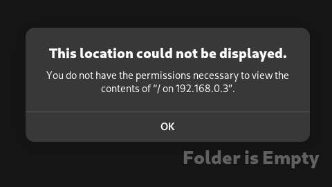

# GSConnect Mount Manager

Automatically organizes and provides seamless access to your Android device storage via GSConnect. Creates clean bookmarks and symlinks for smooth file browsing.



---

## Features

* **🔄 Auto Mount/Unmount** – Detects device connections and handles setup/cleanup automatically.
* **📁 Clean Organization** – Creates `~/Device-Name/` with organized storage folders.
* **🔖 File Manager Integration** – Single bookmark per device with all storage types as subfolders.
* **💻 Terminal Access** – Direct symlinks to internal storage, SD cards, and USB OTG.
* **📱 Multi-Storage Support** – Handles internal storage, SD cards, and USB OTG devices.
* **🔔 Smart Notifications** – Desktop alerts for mount/unmount events.
* **⚙️ Configurable** – Customize via config file (polling, paths, naming, etc.).
* **🛡️ Safe & Reliable** – No GSConnect modifications; automatic error recovery.

---

## Directory Layout

```
~/Device-Name/
  ├── Internal/       # Internal storage
  ├── SDCard/         # SD card (if present)
  └── USB-OTG/        # USB OTG device (if present)
```

**File Manager Experience:**

* Click “Device-Name” bookmark → opens device folder.
* Browse `Internal/`, `SDCard/`, `USB-OTG/` as needed.

**Terminal Access:**

```bash
cd ~/.Device-Name/
```

---

## Installation

```bash
git clone https://github.com/vjaykrsna/gsconnect-mount-manager.git
cd gsconnect-mount-manager
chmod +x install.sh
./install.sh
```

> **Note:** Do NOT run as `sudo` or root; install is per-user.

---

## Updating

```bash
cd gsconnect-mount-manager
./update.sh
```

Pulls latest changes and reinstalls the service.

---

## Requirements

* **GSConnect** (GNOME Shell extension for KDE Connect)
* **GNOME/GTK environment** (for bookmarks)
* **systemd** (user service management)
* **Android device** with KDE Connect app installed

---

## Configuration

Edit `~/.config/gsconnect-mount-manager/config.conf` and restart the service:

```bash
systemctl --user restart gsconnect-mount-manager
```

### General Settings

* `POLL_INTERVAL` – Check interval for device connections (seconds).
* `MOUNT_STRUCTURE_DIR` – Where device folders are created (e.g., `~/Devices`).
* `ENABLE_NOTIFICATIONS` – `true` or `false`.

### Naming & Symlinks

* `SYMLINK_DIR` – Directory to create symlinks in (defaults to `MOUNT_STRUCTURE_DIR`).
* `SYMLINK_PREFIX` / `SYMLINK_SUFFIX` – Add text before/after device name.
* `INTERNAL_STORAGE_NAME` – Folder name for internal storage.
* `EXTERNAL_STORAGE_NAME` – Base name for SD cards.
* `USB_STORAGE_NAME` – Base name for USB-OTG.
* `DETECT_GVFS_PATH` – Automatically detect GVFS mount path.
* `ENABLE_BOOKMARKS` – `true` or `false` to enable/disable GTK bookmarks.
* `BOOKMARK_FILE` – Path to the GTK bookmarks file.

### Storage Detection

* `ENABLE_INTERNAL_STORAGE` – `true` to mount internal storage.
* `ENABLE_EXTERNAL_STORAGE` – `true` for SD/USB detection.
* `INTERNAL_STORAGE_PATH` – Path to internal storage on device.
* `EXTERNAL_STORAGE_PATTERNS` – Patterns to find external storage.
* `MAX_EXTERNAL_STORAGE` – Maximum external drives to mount.
* `STORAGE_TIMEOUT` – Time to wait for storage to appear (seconds).

### Logging & Cleanup

* `LOG_LEVEL` – `DEBUG`, `INFO`, `WARN`, `ERROR`.
* `MAX_LOG_SIZE` – Max log size (MB).
* `LOG_ROTATE_COUNT` – Number of old log files to keep.
* `AUTO_CLEANUP` – `true` to remove broken symlinks automatically.

---

## Management Commands

```bash
systemctl --user status gsconnect-mount-manager
journalctl --user -u gsconnect-mount-manager -f
systemctl --user stop gsconnect-mount-manager
systemctl --user start gsconnect-mount-manager
```

---

## Uninstallation

```bash
chmod +x uninstall.sh
./uninstall.sh
```

Stops the service, removes files, and cleans bookmarks.

---

## Troubleshooting

* **Device not detected:** Check GSConnect is installed and paired; enable file sharing.
* **Bookmarks missing:** Verify `~/.gsconnect-mount/Device-Name/` exists and symlinks are valid.
* **Service issues:** `journalctl --user -u gsconnect-mount-manager -n 20` and restart service.
* **Storage not detected:** Ensure `DETECT_GVFS_PATH` is enabled and patterns match your device.

---

## Debugging

If you encounter issues, you can use the `debug.sh` script to collect system and application information.

```bash
./debug.sh
```

This will create a `gsmm-debug.log` file in the current directory containing detailed information for troubleshooting.

---

## Contributing

1. Fork the repository
2. Create a feature branch
3. Make changes and test thoroughly
4. Submit a pull request

---

## License

MIT License – see LICENSE file.

---
